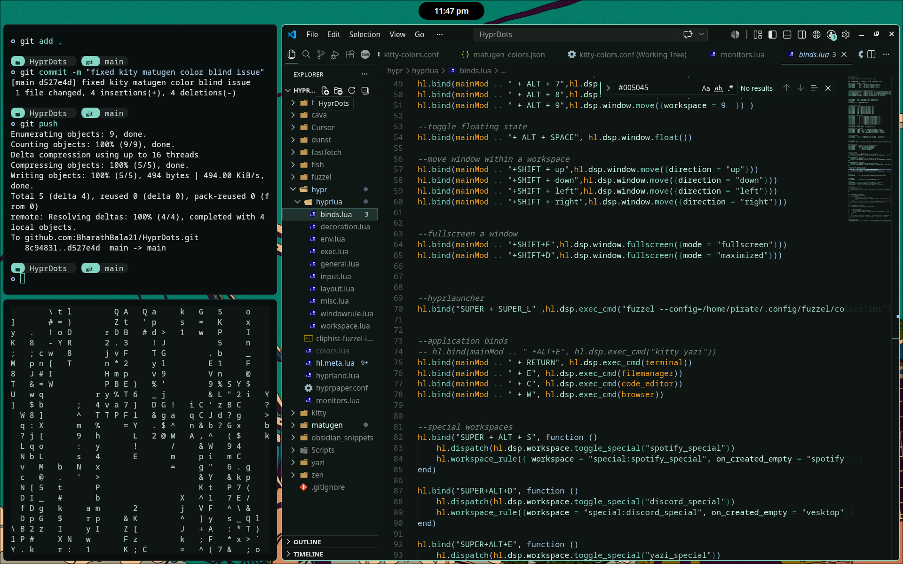
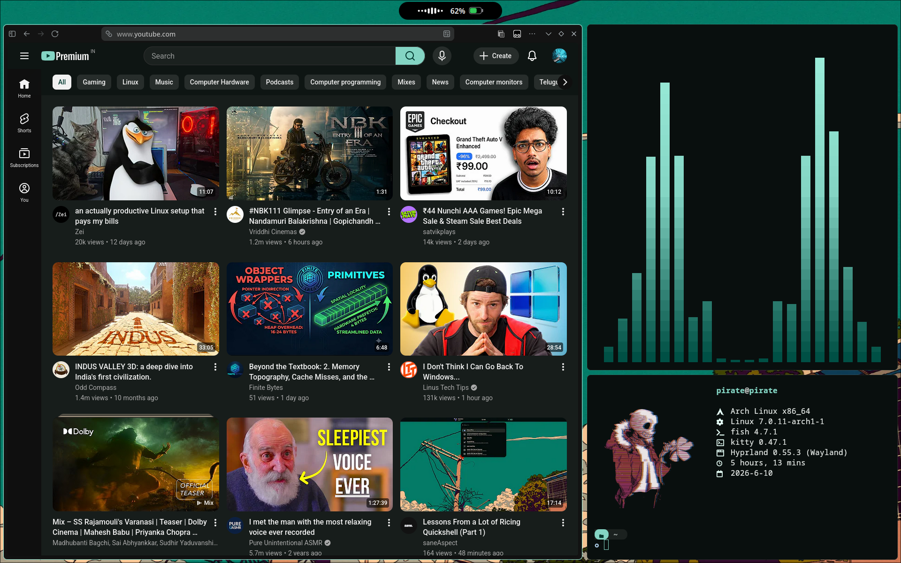
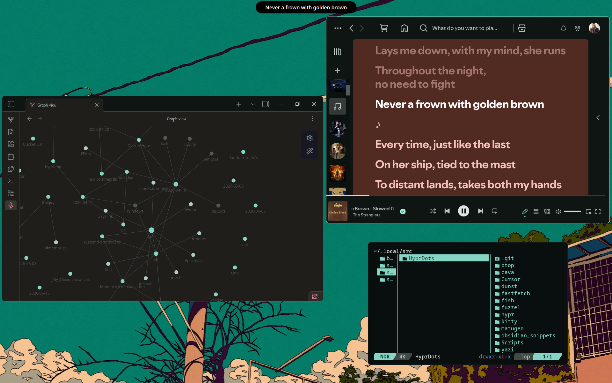
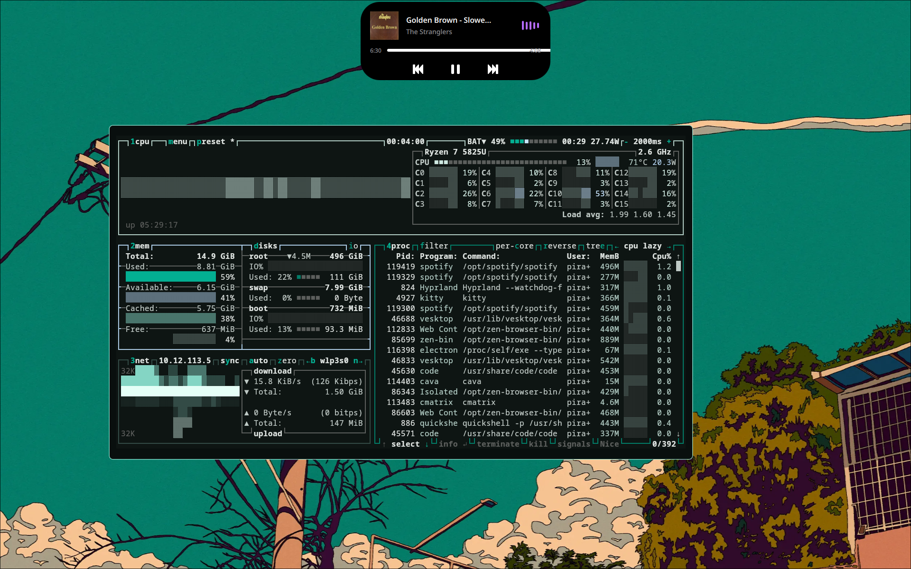

**Personal Dot files for my Arch-Hyprland(Wayland)**

Used [Matugen](https://github.com/InioX/matugen) to generate a color scheme based on the wallpaper and apply it to various applications

  <table style="width: 100%; border-collapse: collapse;">
    <tr>
      <td style="width: 50%;"></td>
      <td style="width: 50%;"></td>
    </tr>
    <tr>
      <td style="width: 50%;"></td>
      <td style="width: 50%;"></td>
    </tr>
  </table>

[Tide-Island](https://github.com/enhaoswen/Tide-island) (_Quickshell_) ❤️
